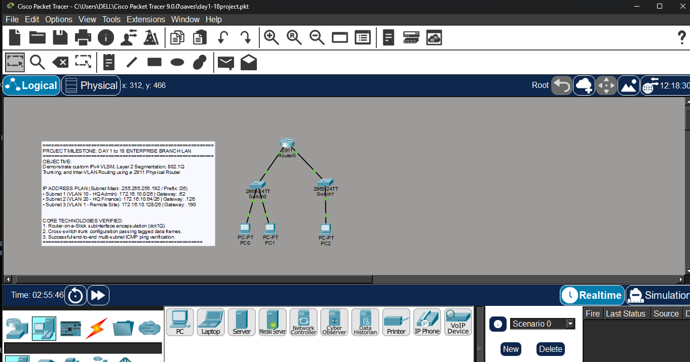
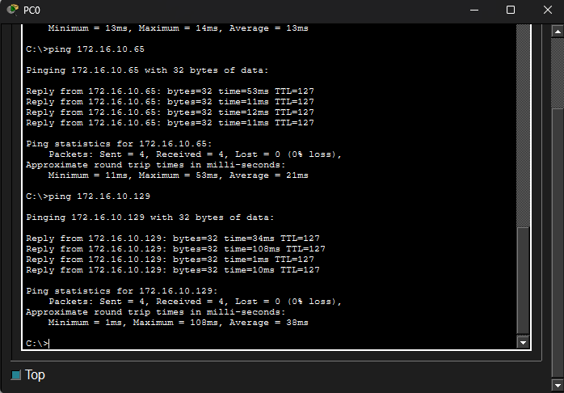

# Lab 01: Multi-Interface Inter-VLAN Routing Architecture

## ## The Network Topology
This is the full visual workspace layout with all interface links fully converged.

## ## Verification & Proof of Concept

### ### Core Routing Table (`show ip route`)
The routing engine dynamically populates its routing table using directly connected interface logic across the virtual subinterfaces.

### ### End-to-End ICMP Ping Success Verification
Successful execution of cross-department and cross-site pings originating from PC0.

