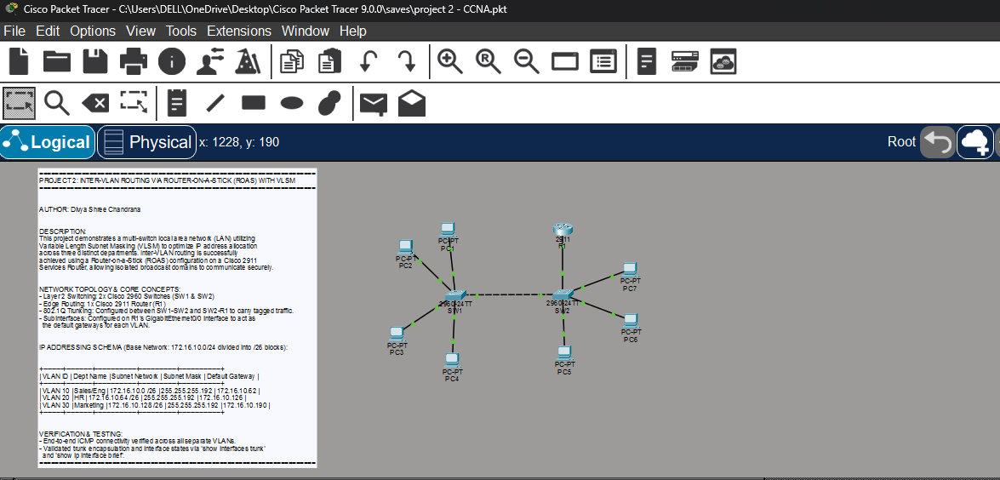
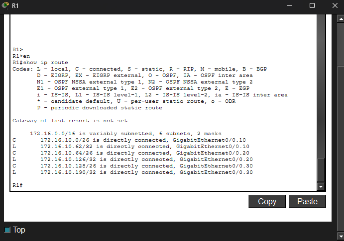
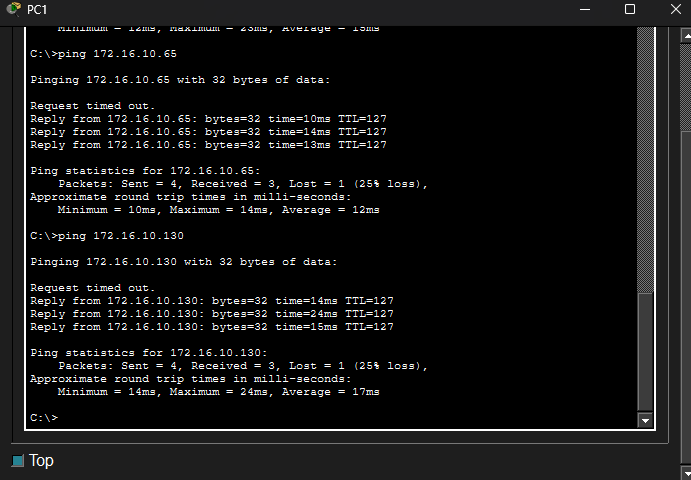

# Lab 02: Router-on-a-Stick (ROAS) Trunk Consolidation

## The Network Topology
This is the full visual workspace layout showcasing multi-switch trunking consolidated into a single physical router interface.

## Verification & Proof of Concept

### Core Routing Table (`show ip route`)
The routing table demonstrates how the router utilizes logical subinterfaces on a single physical port to route traffic dynamically across all corporate subnets.

### End-to-End ICMP Ping Success Verification
Successful execution of cross-VLAN pings showing seamless connectivity between the segmented Sales, HR, and Marketing departments.

