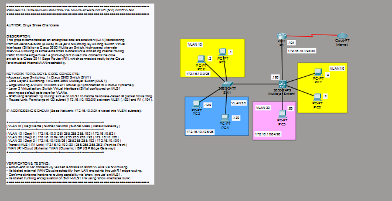
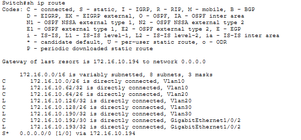
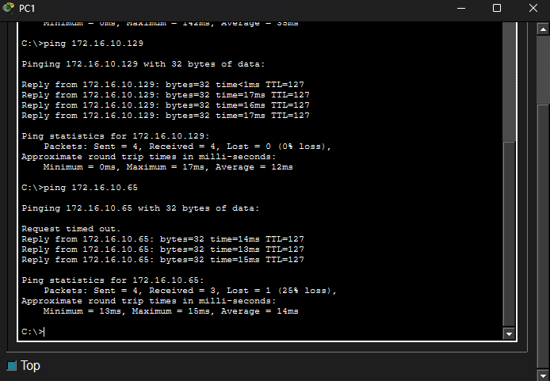

# Lab 03: Multilayer Switching with SVIs, Routed Links & Cloud Integration

## The Network Topology
This is the full visual workspace layout showcasing core inter-VLAN routing using Switch Virtual Interfaces (SVIs) on a Cisco 3650 Multilayer Switch, connected via a dedicated routed `/30` link to the edge router and integrated WAN/Cloud environment.

## Verification & Proof of Concept

### Core Routing Table (`show ip route`)
The routing table verifies active SVI logical interfaces alongside the point-to-point `/30` transit subnet (`172.16.10.192/30`), demonstrating centralized layer 3 switching and static/dynamic route propagation to the edge router.

### End-to-End ICMP Ping & Cloud Reachability Verification
Successful execution of end-to-end ICMP tests confirming high-speed inter-VLAN communication through SVIs and seamless external reachability through the WAN/Cloud gateway.

