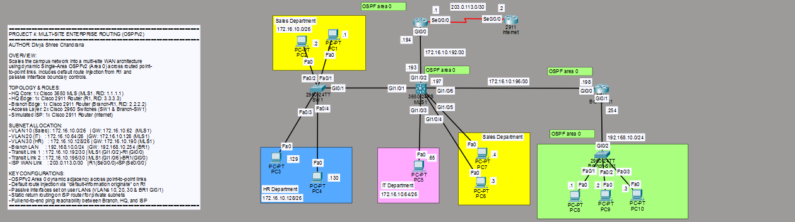
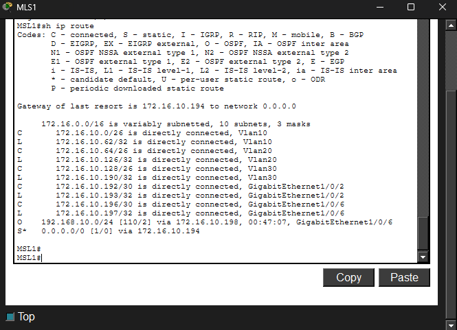
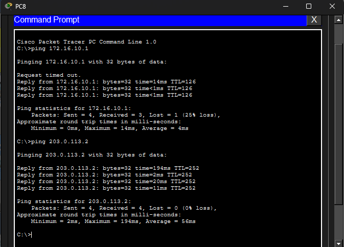

# Lab 04: Single-Area OSPFv2 Dynamic Routing & Multi-Site Enterprise Scalability

## The Network Topology
This is the full visual workspace layout showcasing multi-site enterprise scalability using dynamic Open Shortest Path First (OSPFv2) in single Area 0. The design interconnects the Headquarter (HQ) core multilayer switch to an edge gateway router and a remote branch office router via dedicated point-to-point Layer 3 `/30` links, featuring dynamic route convergence, default route injection, and simulated ISP Internet reachability.

## Verification & Proof of Concept

### OSPF Neighbor Adjacencies (`show ip ospf neighbor`)
The neighbor adjacency table confirms dynamic neighbor discovery, Hello/Dead timer synchronization, and full state convergence (`FULL/DR` and `FULL/BDR`) across all routed point-to-point WAN transit links.

### Routing Protocol & Passive Interface Status (`show ip protocols`)
Verification of the active OSPF process, assigned Router IDs, participating subnets, and passive interface security boundaries that suppress unnecessary Hello broadcasts across user access segments.

### Enterprise Routing Table (`show ip route`)
The routing table verifies dynamically learned inter-site OSPF routes (`O`) alongside the quad-zero default exterior gateway route (`O*E2 0.0.0.0/0`) injected from the edge router.

### End-to-End ICMP Ping & WAN/Internet Reachability Verification
Successful execution of end-to-end ICMP ping tests confirming bidirectional communication from the remote branch LAN across the WAN backbone to HQ departmental VLANs and the external Internet gateway.

