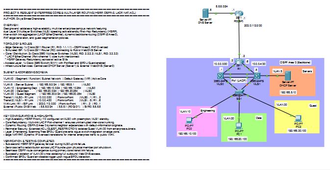
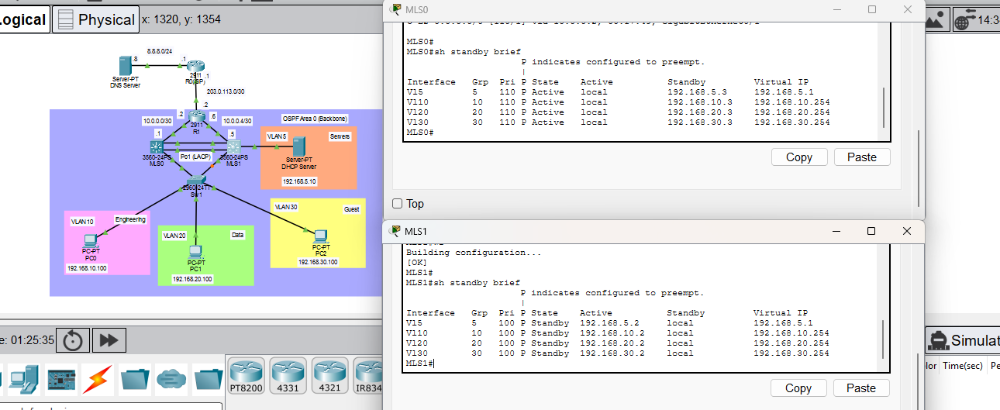
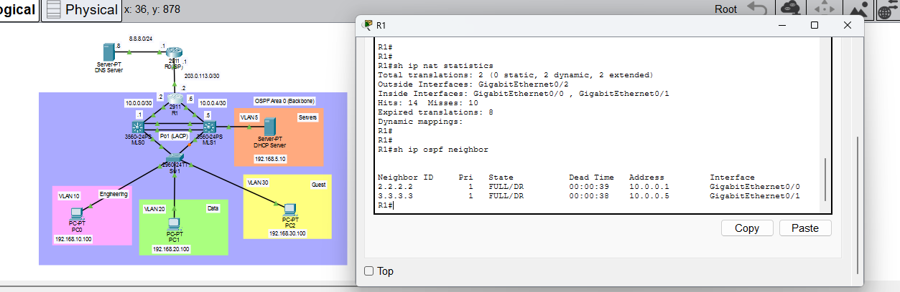
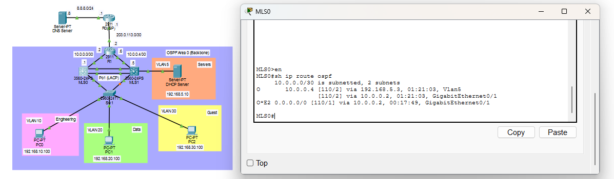
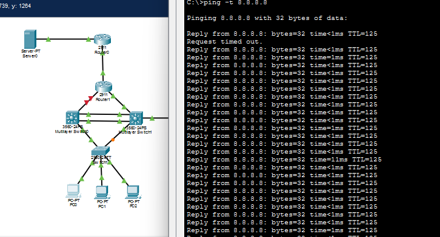
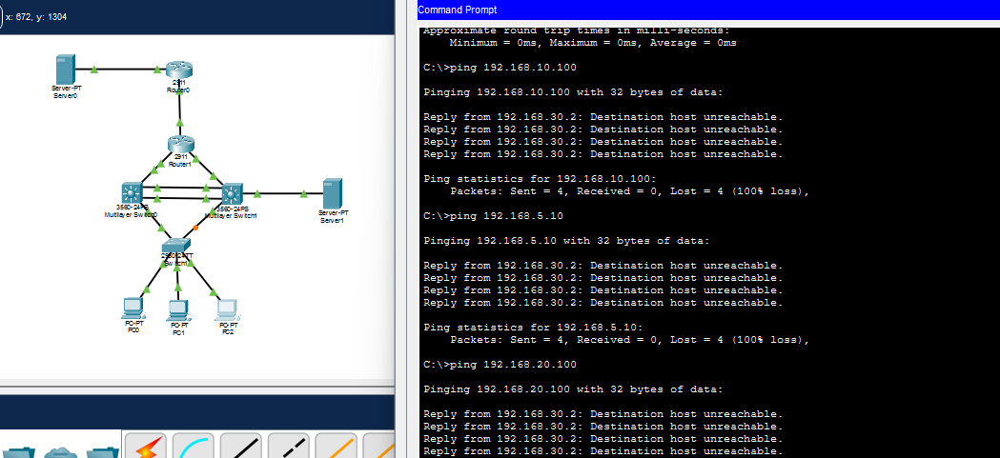
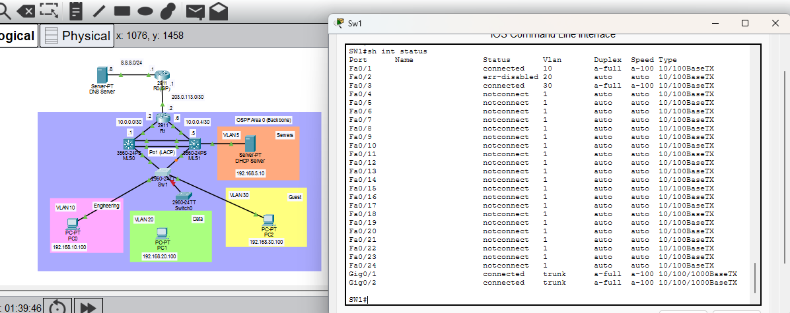
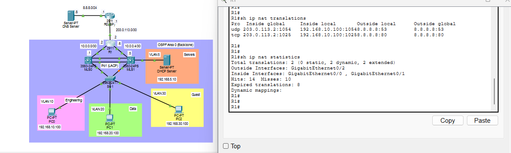
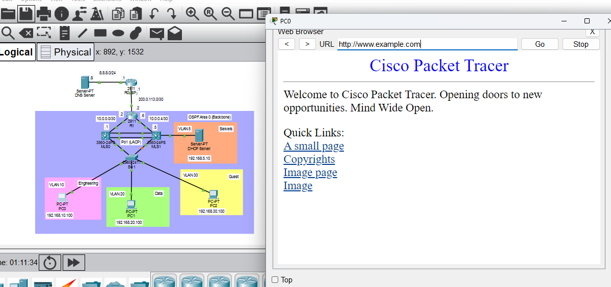

# Lab 05: Resilient Enterprise Core & Multi-Layer Routing (HSRP, OSPFv2, LACP, NAT/PAT & Port Security)

## The Network Topology
This is the full visual workspace layout showcasing a high-availability, fault-tolerant enterprise campus architecture. The design implements dual core multilayer switches operating active/standby First-Hop Redundancy (HSRP) and link aggregation (LACP Port-Channel), single-area dynamic OSPFv2 backbone routing, edge NAT/PAT overload, Layer 2 access port hardening (PortFast & BPDU Guard), and guest traffic segmentation via extended access control lists.

## Verification & Proof of Concept

### 1. High Availability: HSRP Gateway Redundancy (`show standby brief`)
Validation of First-Hop Redundancy Protocol (FHRP) roles across core switches `MLS0` and `MLS1`. `MLS0` operates as the primary `Active` virtual gateway across all VLAN SVIs (Groups 5, 10, 20, 30) due to higher priority (`110`) with preemption enabled, while `MLS1` maintains synchronized `Standby` tracking.

### 2. Core Interconnect Link Resilience: LACP Link Failure Test (`show etherchannel summary`)
Validation of multi-link aggregation resilience across the core switch trunk bundle (`Port-channel 1`). Following an administrative shutdown of member interface `Fa0/1` (flagged as `D`), `Po1` dynamically sustains an operational `SU` (Layer 2, In Use) status with the surviving active interface `Fa0/2` (`P`), preserving inter-core trunking without spanning tree recalculation.

### 3. Dynamic Routing: OSPFv2 Neighbor Adjacency (`show ip ospf neighbor`)
Verification of dynamic interior gateway adjacency formation across the Layer 3 routed transit links (`10.0.0.0/30` and `10.0.0.4/30`). Neighbor states between edge router `R1` and both core multilayer switches confirm complete link-state database synchronization in the `FULL` state.

### 4. Enterprise Core Routing Table (`show ip route ospf`)
Inspection of the routing table on `MLS0` confirming dynamic learning of internal subnets and receipt of the quad-zero default exterior gateway route (`O*E2 0.0.0.0/0`) dynamically injected by edge gateway `R1` via `default-information originate`.

### 5. Uplink Failover & Dynamic OSPF Convergence
Verification of sub-second dynamic rerouting during an active failure of `MLS0`'s primary routed uplink (`Gi0/1` shut down). Continuous ICMP echo requests from host `PC0` to external target `8.8.8.8` demonstrate immediate Shortest Path First (SPF) path recalculation across `Port-channel 1` to `MLS1` with only a single dropped packet before traffic flow is restored.

### 6. Edge Security: Extended ACL Network Segmentation
ICMP verification from guest endpoint `PC2` (`192.168.30.100`) confirming traffic isolation. The inbound extended ACL `GUEST_RESTRICTION` applied to `Vlan 30` drops all attempts to reach private internal enterprise subnets (`192.168.10.0/24`, `192.168.20.0/24`, and server subnet `192.168.5.0/24`) with `Destination host unreachable`, while permitting outbound traffic to the public Internet.

### 7. Layer 2 Access Layer Hardening: BPDU Guard (`show interfaces status`)
Validation of STP edge port protection on access switch `SW1`. Connecting an unauthorized bridge device to host-facing port `FastEthernet 0/1` triggers immediate BPDU Guard violation logging, automatically placing the interface into an `err-disabled` state to mitigate potential Layer 2 switching loops and rogue root bridge elections.

### 8. Edge NAT/PAT Translations (`show ip nat translations`)
Inspection of active Port Address Translation (PAT) sessions on edge router `R1`. Internal private client IP addresses across all authorized VLANs are dynamically translated to public outside interface `Gi0/2` sockets, enabling simultaneous outbound internet access.

### 9. End-to-End DNS Resolution & Web Reachability
Full application-layer verification from LAN endpoint `PC0`. Demonstrates successful DNS query resolution for domain `www.example.com` against external server `8.8.8.8` and complete HTTP payload retrieval through the enterprise switching, routing, and NAT pipeline.

