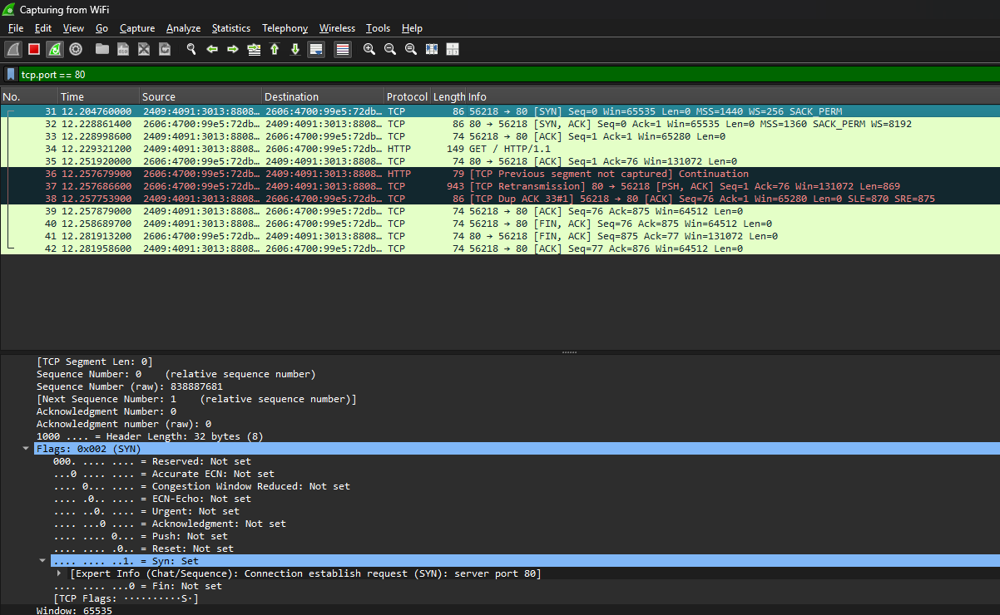

# Lab 01: TCP Connection Establishment & Teardown Analysis

## Objective
Verify the TCP Layer 4 state machine by capturing an unencrypted HTTP session to `example.com` and analyzing sequence/acknowledgment numbers, flags, and teardown behavior.

## Packet Capture Artifacts
- **PCAP File:** `capture.pcapng`
- **Filter Applied:** `tcp.port == 80`

## Protocol Breakdown

### 1. Three-Way Handshake (Connection Establishment)
- **Frame 31 (`[SYN]`):** Client (`Port 56218`) initiates connection to Server (`Port 80`). Initial Relative Sequence Number: `Seq=0`.
- **Frame 32 (`[SYN, ACK]`):** Server acknowledges client SYN with `Ack=1` and presents its initial sequence number `Seq=0`.
- **Frame 33 (`[ACK]`):** Client acknowledges server SYN with `Ack=1`. Connection state enters `ESTABLISHED`.

### 2. HTTP Payload & Retransmission Recovery
- **Frame 35 (`GET / HTTP/1.1`):** Client requests resource (`Len=149`).
- **Frame 36 (`[ACK]`):** Server acknowledges receipt (`Ack=76`).
- **Frames 37–38 (`[TCP Retransmission]` / `[TCP Dup ACK]`):** Wireshark captures TCP reliability mechanisms actively handling segment recovery before application-layer delivery.

### 3. Four-Way Handshake (Connection Teardown)
- **Frame 39 (`[FIN, ACK]`):** Client signals closure (`Seq=76`, `Ack=875`).
- **Frame 40 (`[ACK]`):** Server acknowledges client termination (`Ack=76`).
- **Frame 41 (`[FIN, ACK]`):** Server signals closure to client (`Seq=875`, `Ack=77`).
- **Frame 42 (`[ACK]`):** Client sends final acknowledgment (`Ack=876`). Socket transitions to `CLOSED`.

## Key Takeaways
- TCP provides full-duplex graceful connection teardown using independent `FIN`/`ACK` pairs.
- Window scale factor (`WS=256`) and SACK permissions negotiated during the SYN stage allow dynamic flow control beyond the standard 64 KB limit.
