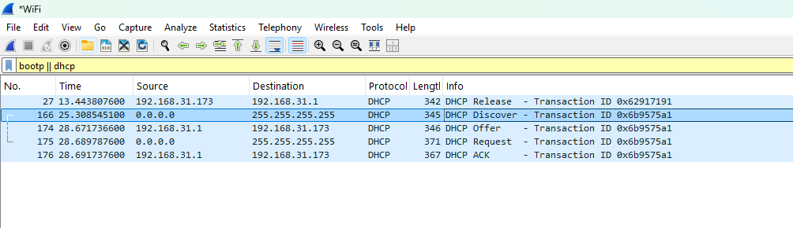

# Protocol Analysis: Full DHCP DORA Lease Acquisition & Options Negotiation

## Overview
This laboratory captures and analyzes an end-to-end Dynamic Host Configuration Protocol (DHCP) lease lifecycle executed over a live Wi-Fi interface using Wireshark. It deconstructs both the initial graceful lease termination (DHCP Release) and the classic four-step DORA bootstrap sequence (Discover, Offer, Request, ACK), tracking Layer 2/Layer 3 address transitions, Transaction ID synchronization, and critical DHCP Option payload parameters.

---

## Capture Details
- **Capture Interface:** Wi-Fi (802.11 / IPv4)
- **Display Filter:** `bootp || dhcp`
- **Transport Ports:** UDP `67` (DHCP Server / Relay Agent) & UDP `68` (DHCP Client)
- **Client Physical Address (MAC):** Intel Mobile Adapter (`68:54:5a:38:84:a2`)
- **Default Gateway / DHCP Server:** `192.168.31.1`
- **Assigned Client IPv4 Address:** `192.168.31.173 /24`
- **Session Transaction ID (`xid`):** `0x6b9575a1`

---

## Detailed Frame-by-Frame Breakdown

### 0. Graceful Teardown: DHCP Release
* **Frame 27 (`DHCP Release`):**
  * **Direction:** Client (`192.168.31.173:68`) $\rightarrow$ Server (`192.168.31.1:67`)
  * **Layer 2 Addressing:** Unicast Client MAC $\rightarrow$ Gateway MAC
  * **Transaction ID:** `0x62917191`
  * **Analysis:** Triggered via `ipconfig /release`. The client relinquishes its existing IPv4 binding. Notice this message is transmitted as an IP unicast frame because the endpoint still possesses valid routing and socket binding information prior to detachment.

---

### 1. Discover: Initial Network Broadcast
* **Frame 166 (`DHCP Discover`):**
  * **Direction:** Client (`0.0.0.0:68`) $\rightarrow$ Broadcast (`255.255.255.255:67`)
  * **Layer 2 Addressing:** Client MAC $\rightarrow$ Broadcast (`ff:ff:ff:ff:ff:ff`)
  * **Transaction ID:** `0x6b9575a1`
  * **Analysis:** The client has no assigned IP address and broadcasts to the local segment to discover active DHCP servers. Header examination confirms `Option 53: DHCP Message Type = Discover (1)` and client parameter request lists (Subnet Mask, Router, DNS, Domain Name).

---

### 2. Offer: Gateway Lease Proposal
* **Frame 174 (`DHCP Offer`):**
  * **Direction:** Server (`192.168.31.1:67`) $\rightarrow$ Client (`192.168.31.173:68`)
  * **Layer 2 Addressing:** Gateway MAC $\rightarrow$ Client MAC (`68:54:5a:38:84:a2`)
  * **Transaction ID:** `0x6b9575a1`
  * **Analysis:** Server responds with a proposed IP address mapped inside the `Your (client) IP address: 192.168.31.173` field. The server provides essential network configuration parameters:
    * `Option 1: Subnet Mask (255.255.255.0)`
    * `Option 3: Router / Default Gateway (192.168.31.1)`
    * `Option 6: Domain Name Server (192.168.31.1)`
    * `Option 51: IP Address Lease Time`
    * `Option 54: DHCP Server Identifier (192.168.31.1)`

---

### 3. Request: Explicit Selection & Reservation
* **Frame 175 (`DHCP Request`):**
  * **Direction:** Client (`0.0.0.0:68`) $\rightarrow$ Broadcast (`255.255.255.255:67`)
  * **Layer 2 Addressing:** Client MAC $\rightarrow$ Broadcast (`ff:ff:ff:ff:ff:ff`)
  * **Transaction ID:** `0x6b9575a1`
  * **Analysis:** Although the client received an offer, it does not officially own the address until acknowledged. It broadcasts from `0.0.0.0` with `Option 50 (Requested IP Address: 192.168.31.173)` and `Option 54 (Server Identifier: 192.168.31.1)` to explicitly claim this offer while signaling to any other listening DHCP servers that their offers were not chosen.

---

### 4. Acknowledgment: Final Lease Commitment
* **Frame 176 (`DHCP ACK`):**
  * **Direction:** Server (`192.168.31.1:67`) $\rightarrow$ Client (`192.168.31.173:68`)
  * **Layer 2 Addressing:** Gateway MAC $\rightarrow$ Client MAC
  * **Transaction ID:** `0x6b9575a1`
  * **Analysis:** The DHCP server commits the IP address binding to its active database and returns the final `DHCP ACK` (`Option 53: Message Type = ACK (5)`). The client enters the `BOUND` state, installs the default route into its local routing table, and activates network connectivity.

---

## Key Protocol Insights
1. **Transaction ID (`xid`) Tracking:** Across frames 166, 174, 175, and 176, the Transaction ID remains locked at `0x6b9575a1`, enabling asynchronous correlation of frames between client and server across shared media.
2. **Unicast vs. Broadcast Transition:** While initial Discovers and Requests originate from `0.0.0.0` to Layer 2/3 broadcast targets, the server directs the Offer and ACK directly to the client's Layer 2 MAC address, bypassing the need for an existing IP stack binding on the host.
3. **DHCP Option Architecture:** Proves that DHCP is not simply an IP-vending mechanism, but a configuration distribution protocol delivering gateways (Option 3), name servers (Option 6), and lease timers (Option 51) in a single unified handshake.
